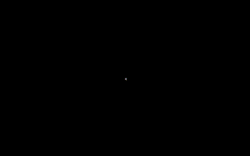

# Attractors

Using the PyGame library to visualise strange attractors.



For more info and examples see:
- https://en.wikipedia.org/wiki/Attractor
- https://en.wikipedia.org/wiki/Lorenz_system
- https://www.behance.net/gallery/7618879/Strange-Attractors
- http://www.3d-meier.de/tut19/Seite3.html
- http://paulbourke.net/fractals/sprott/
- https://examples.pyviz.org/attractors/attractors.html

## Run Instructions

```bash
# uses 'venv' module to create a venv in the venv dir. pip's also copied in.
python3 -m venv venv

# activates virtual environment by editing PATH to first look in venv/bin/
# pip now installs modules to local repo under venv/lib/python3.x/site-packages/
source venv/bin/activate

# modules listed in requirements.txt install to venv
pip --require-virtualenv install --requirement requirements.txt

# to manually install a new module later
pip --require-virtualenv install <module_name>

python3 src/main.py

# deactivates venv and resets PATH back. this (should) work anywhere
deactive
```

NOTE: for auto-managed venv use pipx (installable through brew)

## Docs
[wasmer](./docs/wasmer.md)
[brython](./docs/brython.md)

##### Related Repo's
- https://github.com/BrutPitt/glChAoS.P
- https://github.com/cimi/many-worlds
- https://github.com/MarioAriasGa/lorenz
- https://www.youtube.com/watch?v=f0lkz2gSsIk&ab_channel=TheCodingTrain
- https://github.com/jonnyhyman/Chaos
- https://github.com/liabru/matter-attractors
- https://github.com/anuraghazra/EvolutionAquerium
